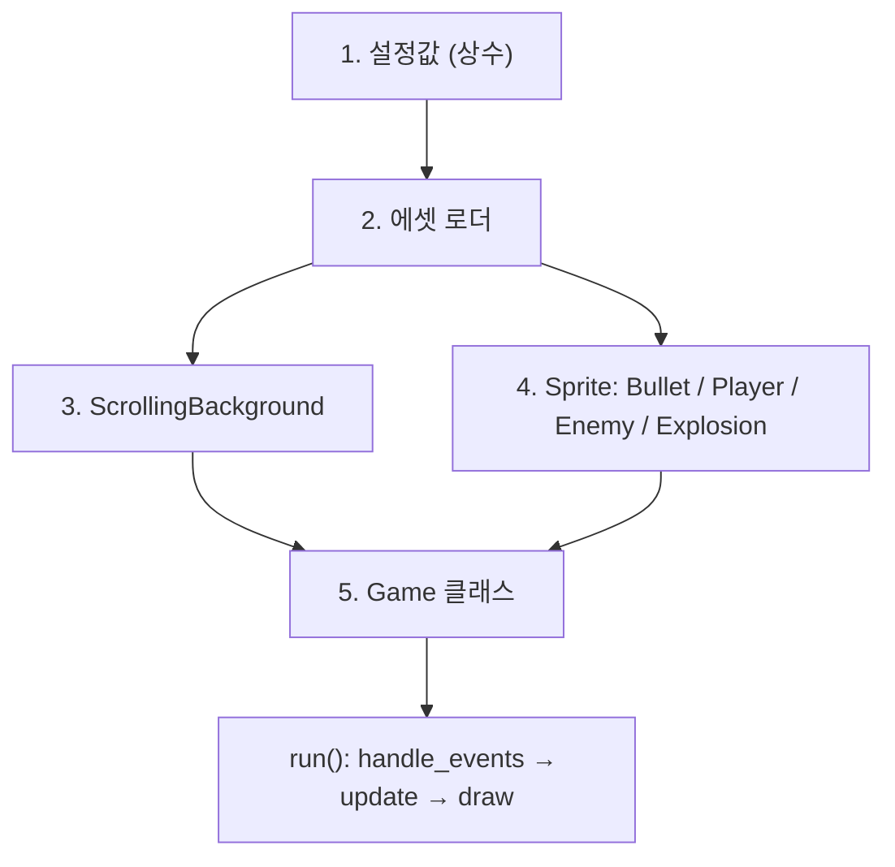
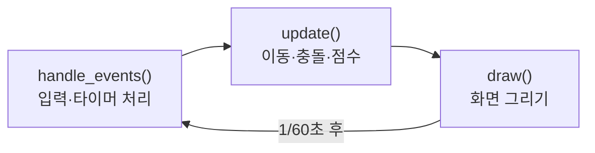
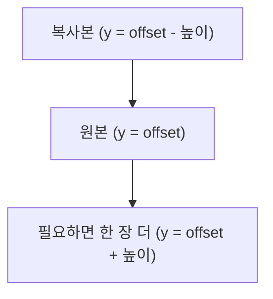
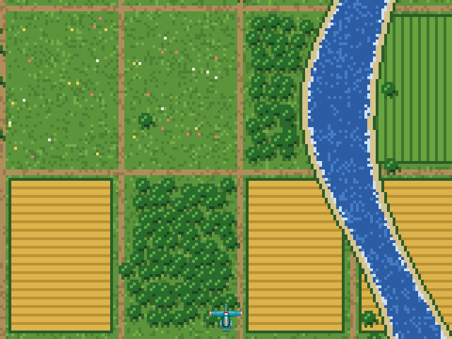
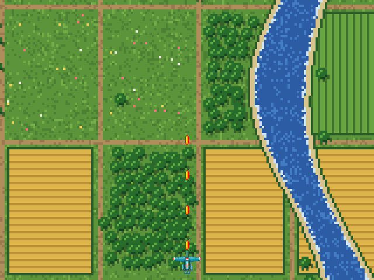
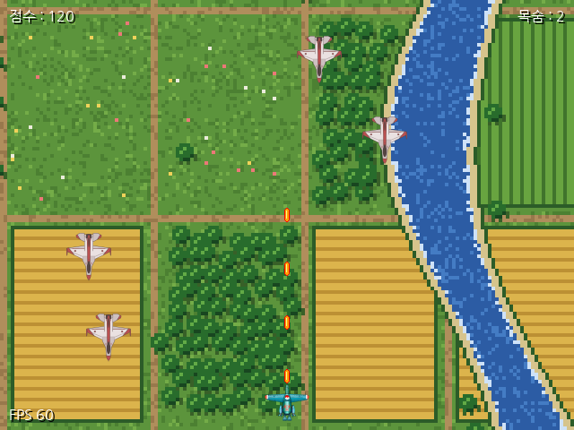
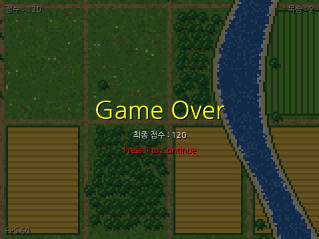
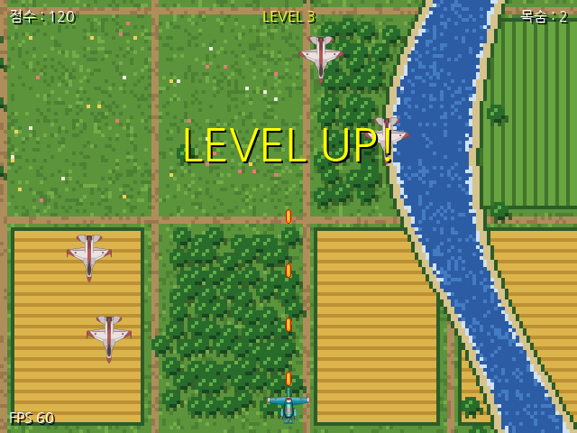
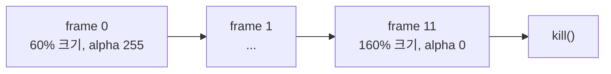
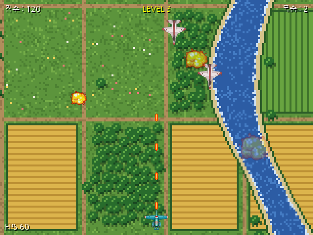

# Sky Defender 코딩 Walkthrough

> 선수 지식: Python 기초 문법(클래스, 상속, 리스트/딕셔너리, `try/except`), pygame 설치 완료
> 기준 환경: Python 3.11, pygame 2.6.x
> 이 문서의 코드를 순서대로 따라 치면 최종적으로 `sky_defender.py` 와 동일한 파일이 완성된다.

종스크롤 슈팅 게임 "Sky Defender" 를 9개의 마일스톤으로 나눠 단계별로 완성한다.
각 마일스톤은 **실행 가능한 상태**로 끝나며, 실행했을 때 화면에 무엇이 보여야 하는지 스크린샷으로 확인한다.

**학습 목표**

- pygame 의 게임 루프(이벤트 → 업데이트 → 그리기)를 클래스 구조로 설계할 수 있다
- `Sprite` 와 `Group` 을 사용해 총알/적/이펙트를 독립적인 객체로 관리할 수 있다
- 타이머 이벤트, 충돌 판정, 상태(state) 분리로 게임 규칙을 구현할 수 있다
- 매직 넘버를 설정값으로 분리하고, 에셋 누락 같은 예외 상황을 처리할 수 있다
- 시간 기반 난이도 조절과 단일 이미지 애니메이션(폭발 효과)을 구현할 수 있다

---

## 1. 마일스톤 한눈에 보기

| 단계 | 주제 | 이 단계에서 추가되는 것 | 실행하면 보이는 것 |
|------|------|------------------------|-------------------|
| M1 | 창과 게임 루프 | 설정값, `Game` 골격, `run/handle_events/update/draw` | 검은 창, ESC 로 종료 |
| M2 | 에셋 로더와 배경 | `load_image`, `load_font`, `ScrollingBackground` | 배경이 아래로 끝없이 흐름 |
| M3 | 플레이어 | `Player` sprite, `Group` | 비행기가 방향키로 움직이고 화면 밖으로 못 나감 |
| M4 | 총알 | `Bullet` sprite, 발사 쿨타임 | Space 로 총알 연사 |
| M5 | 적 | `Enemy` sprite, 타이머 이벤트 | 적이 위에서 내려와 하단으로 사라짐 |
| M6 | 충돌·점수·목숨·HUD | `check_collisions`, `draw_text`, `draw_hud` | 총알에 맞은 적이 사라지고 점수 증가, 목숨 감소 |
| M7 | 게임 오버와 재시작 | 상태(state), 오버레이, R 키 | 목숨 0 이면 Game Over 화면, R 로 재시작 |
| M8 | 난이도 레벨 | `apply_difficulty`, `update_difficulty` | 20초마다 LEVEL UP, 적이 빨라지고 많아짐 |
| M9 | 폭발 효과 | `Explosion` sprite, `effects` 그룹 | 격추 위치에 폭발이 커지며 사라짐 |

전체 구조는 다음과 같다. 각 마일스톤은 이 그림의 상자를 하나씩 채워 나간다.



> 중요: 각 마일스톤이 끝날 때마다 반드시 실행해서 "실행 결과" 와 같은 화면이 나오는지 확인한다.
> 다음 단계로 넘어간 뒤 오류가 나면 원인 범위가 넓어져 찾기 어렵다.

---

## 2. 준비

### 2.1 설치와 파일 배치

```bash
pip install pygame
```

작업 폴더에 아래 파일을 둔다. 이미지/폰트가 없어도 대체 도형으로 실행은 되지만, 완성된 모습을 보려면 준비하는 것이 좋다.

| 파일 | 용도 | 없을 때 |
|------|------|--------|
| `sky_defender.py` | 우리가 작성할 소스 | - |
| `classic_bg_800x1400_seamless.png` | 위아래가 이어지는 배경 | 진한 초록 단색 |
| `shooter1.png` | 아군 비행기 | 파란 삼각형 |
| `enemy1.png` | 적 비행기 | 빨간 역삼각형 |
| `explosion.png` | 폭발 (M9) | 주황 원 |
| `NanumGothic.ttf` | 한글 폰트 | 기본 폰트 (한글 깨짐) |

### 2.2 실행 방법

```bash
python sky_defender.py
```

조작: 방향키 이동, Space 발사, R 재시작(게임 오버 후), ESC 종료

---

## 3. M1. 창과 게임 루프

**목표**: 640x480 창을 띄우고, 닫기 버튼이나 ESC 로 종료되는 "게임 루프" 를 만든다.

### 3.1 파일 헤더와 import

파일 맨 위에 작성한다. docstring 은 이 파일의 지도 역할을 하므로 먼저 써 두면 구조를 잊지 않는다.

```python
"""
종스크롤 디펜더 슈팅 게임 (pygame 2.x)

[게임 규칙]
  - 방향키: 이동 / Space: 발사 / R: 게임오버 후 재시작 / ESC: 종료
  - 적이 화면 하단을 통과하거나 아군과 부딪히면 목숨 -1, 라운드 리셋
  - 목숨 3개를 모두 잃으면 게임 오버

[코드 구조]
  1. 설정값        : 난이도·크기·색 등 "숫자"를 한곳에 모아 조절하기 쉽게 함
  2. 에셋 로더     : 파일 경로/로딩 실패 처리를 한곳에서 담당
  3. 배경          : 이음새 없는 이미지를 무한 스크롤
  4. 스프라이트    : Bullet / Player / Enemy - 각자 "자기 움직임"만 책임짐
  5. Game 클래스   : 이벤트 → 업데이트 → 그리기 순서의 게임 루프와 규칙(점수·목숨) 담당

[필요 파일] (이 파일과 같은 폴더)
  classic_bg_800x1400_seamless.png, shooter1.png, enemy1.png, NanumGothic.ttf
  ※ 파일이 없어도 대체 도형/기본 폰트로 실행은 됨 (에셋 로더 참고)
"""
import os
import random
import sys

import pygame
```

| import | 어디서 쓰나 |
|--------|------------|
| `os` | 에셋 파일 경로 계산 (M2) |
| `random` | 적의 출현 위치/속도 (M5) |
| `sys` | 종료 시 `sys.exit()` |
| `pygame` | 전부 |

### 3.2 설정값 블록

숫자를 코드 곳곳에 직접 쓰면(매직 넘버) 나중에 "적을 조금 느리게" 같은 조절을 할 때 어디를 고쳐야 할지 찾기 어렵다.
**대문자 상수**로 한곳에 모아 두면 밸런스 조절이 "이 블록만 수정" 으로 끝난다.

```python
# =====================================================================
# 1. 설정값
#    - 코드 곳곳에 숫자를 직접 쓰면(매직 넘버) 난이도 조절 시 찾기 어렵다.
#    - 대문자 상수로 모아두면 "밸런스 조절 = 이 블록만 수정"이 된다.
#    - 속도 단위는 px/frame 이다. FPS를 60으로 고정하므로 초당 이동량 = 값 × 60
# =====================================================================
SCREEN_WIDTH, SCREEN_HEIGHT = 640, 480
FPS = 60
TITLE = "Sky Defender"
```

색 상수도 지금 만들어 둔다. 이후 단계에서 계속 사용한다.

```python
# 색 (R, G, B)
WHITE = (255, 255, 255)
BLACK = (0, 0, 0)
RED = (255, 0, 0)
ORANGE = (255, 165, 0)
YELLOW = (255, 255, 0)
BULLET_CORE = (255, 240, 150)
```

> 팁: 이후 단계에서 "설정값에 추가" 라고 하면 `SCREEN_WIDTH` 줄과 `# 색` 블록 사이에 넣는다.
> 최종 파일에서는 게임 규칙 → 배경 → 플레이어 → 총알 → 적 → 폭발 → 난이도 → 색 → 에셋 파일명 순서다.

### 3.3 Game 클래스 골격

게임은 매 프레임 같은 세 가지 일을 반복한다. 이것이 **게임 루프**다.



```python
# =====================================================================
# 5. Game - 게임 루프와 규칙
# =====================================================================
class Game:
    """
    게임 루프의 기본 형태 (매 프레임 반복)

        handle_events()  : 입력/타이머 이벤트 처리
        update()         : 위치 이동, 충돌, 점수/목숨 계산  ← 한 프레임에 한 번만!
        draw()           : 화면 그리기

    상태(state)를 두어 "플레이 중"과 "게임 오버"의 동작을 분리한다.
    (if game_over: ... continue 방식보다 흐름이 명확하고 상태 추가가 쉬움)
    """

    def __init__(self):
        pygame.init()
        self.screen = pygame.display.set_mode((SCREEN_WIDTH, SCREEN_HEIGHT))
        pygame.display.set_caption(TITLE)
        self.clock = pygame.time.Clock()

        self.running = True

    # ------------------------------------------------------------------
    # 게임 루프
    # ------------------------------------------------------------------
    def run(self) -> None:
        while self.running:
            # tick() 은 직전 프레임 이후 흐른 시간(ms)을 반환 → 난이도용 시간 측정에 사용
            dt = self.clock.tick(FPS)     # 최대 60FPS 로 제한 (px/frame 속도의 기준)
            self.handle_events()
            self.update()
            self.draw()
        pygame.quit()

    def handle_events(self) -> None:
        for event in pygame.event.get():
            if event.type == pygame.QUIT:
                self.running = False    # 게임 루프를 빠져나오는 flag, false이면 종료(게임 루프 탈출)

            elif event.type == pygame.KEYDOWN:
                if event.key == pygame.K_ESCAPE:
                    self.running = False

    def update(self) -> None:
        pass

    # ------------------------------------------------------------------
    # 그리기 (뒤에 있는 것부터: 배경 → 스프라이트 → UI)
    # ------------------------------------------------------------------
    def draw(self) -> None:
        self.screen.fill(BLACK)

        # 메모리에 그린 화면을 실제 모니터에 한 번에 반영 (더블 버퍼링 → 깜빡임 방지)
        pygame.display.flip()
```

| 코드 | 하는 일 |
|------|--------|
| `pygame.init()` | 모든 pygame 모듈 초기화. 다른 pygame 함수보다 먼저 호출 |
| `set_mode()` | 창을 만들고, 그 창에 그릴 수 있는 `Surface` 를 돌려줌 |
| `Clock.tick(FPS)` | 직전 호출 이후 1/60초가 안 지났으면 기다림. 컴퓨터 성능과 무관하게 속도가 일정해짐 |
| `event.get()` | 큐에 쌓인 이벤트를 전부 꺼냄. 안 꺼내면 창이 "응답 없음" 이 됨 |
| `display.flip()` | 메모리(백버퍼)에 그린 내용을 모니터에 한 번에 표시 |

> 주의: `dt` 변수는 지금 사용하지 않지만 M8 에서 난이도 계산에 쓴다. 지금 미리 받아 두면 M8 에서 `run()` 을 수정하지 않아도 된다.

### 3.4 실행 진입점

파일 맨 아래에 작성한다.

```python
# =====================================================================
# 실행 진입점
#  - 이 파일을 직접 실행할 때만 게임 시작
#  - 다른 파일에서 import 할 때는 실행되지 않음 (클래스 재사용/테스트 가능)
# =====================================================================
if __name__ == "__main__":
    Game().run()
    sys.exit()
```

### 3.5 실행 결과


- 제목이 "Sky Defender" 인 검은 창이 뜬다
- 창 닫기 버튼 또는 ESC 를 누르면 종료된다
- 터미널에 오류가 없어야 한다

**체크포인트**: `update()` 와 `draw()` 를 서로 바꿔 호출하면 어떻게 될까? (답: 지금은 차이가 없지만, 이후 "이동한 뒤 그리기" 순서가 어긋나면 한 프레임 늦게 보인다)

---

## 4. M2. 에셋 로더와 스크롤 배경

**목표**: 이미지 파일을 안전하게 불러오고, 배경이 아래로 끝없이 흐르게 한다.

### 4.1 설정값에 추가

```python
# 배경
SCROLL_SPEED = 1                  # 배경 스크롤 속도 (초당 60px)
```

에셋 파일명은 `# 색` 블록 **아래**에 둔다. M9 에서 쓸 `EXPLOSION_FILE` 도 지금 함께 적어 둔다.

```python
# 에셋 파일명
BG_FILE = "classic_bg_800x1400_seamless.png"
PLAYER_FILE = "shooter1.png"
ENEMY_FILE = "enemy1.png"
EXPLOSION_FILE = "explosion.png"
FONT_FILE = "NanumGothic.ttf"
```

### 4.2 에셋 로더

설정값 블록과 `Game` 클래스 사이에 작성한다.

`pygame.image.load("shooter1.png")` 처럼 상대 경로를 쓰면 **터미널의 현재 위치**를 기준으로 찾기 때문에, 다른 폴더에서 실행하거나 IDE 에서 실행하면 파일을 못 찾는다.
`__file__` 은 항상 이 소스 파일의 경로이므로 이를 기준으로 삼는다.

```python
# =====================================================================
# 2. 에셋 로더
# =====================================================================
# 이 .py 파일이 있는 폴더를 기준으로 경로를 만든다.
#  - sys.argv[0]은 IDE 실행/모듈 import 시 빈 문자열이 될 수 있어 불안정하다.
#  - __file__ 은 항상 "현재 소스 파일" 경로이므로 어디서 실행해도 같은 결과가 나온다.
BASE_DIR = os.path.dirname(os.path.abspath(__file__))


def asset_path(filename: str) -> str:
    """에셋 파일의 절대 경로를 반환 (실행 위치와 무관하게 동일)"""
    return os.path.join(BASE_DIR, filename)


def load_image(filename: str, alpha: bool = True,
               fallback_size=(40, 40), fallback_color=WHITE,
               pointing_up: bool = True, fallback_shape: str = "triangle") -> pygame.Surface:
    """
    이미지를 불러와 화면 픽셀 포맷으로 변환해 반환한다.

    - convert()       : 불투명 이미지(배경)용. blit 속도가 수 배 빨라진다.
    - convert_alpha() : 투명 영역이 있는 이미지(비행기)용.
    - 파일이 없으면 삼각형 대체 이미지를 만들어 게임이 멈추지 않게 한다.
      (수업 중 파일 누락으로 실습이 중단되는 상황 방지)

    ※ convert 계열은 display.set_mode() 이후에만 호출할 수 있다.
    """
    path = asset_path(filename)
    try:
        image = pygame.image.load(path)
    except (FileNotFoundError, pygame.error):
        print(f"[경고] 이미지 파일 없음: {path} → 대체 도형 사용")
        w, h = fallback_size
        image = pygame.Surface((w, h), pygame.SRCALPHA)
        if fallback_shape == "circle":
            pygame.draw.circle(image, fallback_color, (w // 2, h // 2), min(w, h) // 2)
        else:
            points = [(w // 2, 0), (0, h), (w, h)] if pointing_up else [(0, 0), (w, 0), (w // 2, h)]
            pygame.draw.polygon(image, fallback_color, points)
        return image
    return image.convert_alpha() if alpha else image.convert()


def load_font(size: int) -> pygame.font.Font:
    """한글 폰트를 불러오고, 없으면 pygame 기본 폰트로 대체 (한글은 깨질 수 있음)"""
    try:
        return pygame.font.Font(asset_path(FONT_FILE), size)
    except (FileNotFoundError, OSError):
        print(f"[경고] 폰트 파일 없음: {asset_path(FONT_FILE)} → 기본 폰트 사용")
        return pygame.font.Font(None, size)
```

| 매개변수 | 의미 |
|---------|------|
| `alpha` | `True` 면 투명 영역을 유지(`convert_alpha`), `False` 면 불투명 변환(`convert`). 배경만 `False` |
| `fallback_size` / `fallback_color` | 파일이 없을 때 그릴 대체 도형의 크기와 색 |
| `pointing_up` | 대체 삼각형의 방향. 적은 아래를 향하므로 `False` |
| `fallback_shape` | `"triangle"` 또는 `"circle"`. 폭발 대체용(M9) |

> 중요: `convert()` 는 이미지를 화면과 같은 픽셀 포맷으로 바꿔 `blit` 을 수 배 빠르게 한다.
> 단, 창이 만들어진(`set_mode`) 뒤에만 호출할 수 있으므로 이미지 로드는 `Game.__init__` 안에서 한다.

### 4.3 ScrollingBackground

배경이 "끝없이" 흐르게 하려면 이미지가 화면 아래로 빠져나간 만큼 위쪽에 같은 이미지를 이어 붙여야 한다.
`offset` 을 이미지 높이로 나눈 **나머지**로 관리하면 값이 무한히 커지지 않고 항상 `[0, 높이)` 안에서 순환한다.



```python
# =====================================================================
# 3. 배경 - 이음새 없는 이미지 무한 스크롤
# =====================================================================
class ScrollingBackground:
    """
    [원리]
      위아래가 이어지는 이미지는 "이미지 top 위에 같은 이미지가 또 붙어 있을 때"
      경계가 보이지 않는다. 그래서 위치(offset)를 이미지 높이로 나눈 나머지로
      순환시키고, 원본 위쪽에 복사본을 이어 그린다.

          ┌────────┐ ← offset - 높이   (복사본)
          │ 화면   │
          │────────│ ← offset          (원본)
          └────────┘

      기존 방식처럼 끝에서 "처음 위치로 순간이동"시키면 보이는 영역이
      한 번에 바뀌어 끊겨 보인다.
    """

    def __init__(self, image: pygame.Surface, screen_height: int, speed: float):
        self.image = image
        self.height = image.get_height()
        self.screen_height = screen_height
        self.speed = speed
        self.offset = 0.0
        self.reset()

    def reset(self) -> None:
        """이미지 아랫부분이 화면에 보이는 위치에서 시작 (0 <= offset < 높이 로 정규화)"""
        self.offset = -(self.height - self.screen_height) % self.height

    def update(self) -> None:
        # 모듈로(%) 연산 → 값이 계속 커지지 않고 항상 [0, 높이) 범위에서 순환
        self.offset = (self.offset + self.speed) % self.height

    def draw(self, surface: pygame.Surface) -> None:
        # 한 장 위(복사본)부터 화면 아래 끝까지 필요한 만큼 이어 그린다.
        # 화면이 이미지보다 높아져도 빈틈이 생기지 않도록 while 사용
        y = int(self.offset) - self.height
        while y < self.screen_height:
            surface.blit(self.image, (0, y))
            y += self.height
```

### 4.4 Game 에 연결

`Game.__init__` 의 `self.clock = ...` 줄 아래에 추가한다.

```python
        # ── 에셋 로드 (set_mode 이후여야 convert 가능) ──
        self.background = ScrollingBackground(
            load_image(BG_FILE, alpha=False, fallback_size=(SCREEN_WIDTH, SCREEN_HEIGHT),
                       fallback_color=(40, 90, 50)),
            SCREEN_HEIGHT, SCROLL_SPEED)
```

`update()` 와 `draw()` 를 아래처럼 바꾼다.

```python
    def update(self) -> None:
        self.background.update()          # 게임오버 화면에서도 배경은 계속 흐르게

    def draw(self) -> None:
        self.background.draw(self.screen)

        # 메모리에 그린 화면을 실제 모니터에 한 번에 반영 (더블 버퍼링 → 깜빡임 방지)
        pygame.display.flip()
```

### 4.5 실행 결과


- 배경이 초당 60px 속도로 아래로 흐른다
- 이미지 끝과 처음이 만나는 지점에서 끊김이 보이지 않는다
- 배경 파일을 잠시 다른 이름으로 바꾸고 실행하면 터미널에 `[경고]` 가 찍히고 진한 초록 화면이 나온다

**체크포인트**: `SCROLL_SPEED` 를 5 로 바꾸면 무엇이 달라지는가? `reset()` 이 `offset = 0` 이 아닌 이유는? (답: 이미지 아랫부분부터 보여 주기 위해서. 0 이면 이미지 윗부분부터 시작한다)

---

## 5. M3. 플레이어

**목표**: 아군 비행기를 화면 하단 중앙에 놓고, 방향키로 움직이되 화면 밖으로 못 나가게 한다.

### 5.1 설정값에 추가

```python
# 플레이어
PLAYER_SPEED = 5                  # 초당 300px
PLAYER_BOTTOM_MARGIN = 10         # 시작 위치: 화면 하단에서 띄울 거리
SHOT_DELAY_MS = 100               # 발사 간격(ms). 작을수록 연사가 빨라짐
```

### 5.2 Sprite 개념

`pygame.sprite.Sprite` 를 상속하고 `self.image` 와 `self.rect` 두 속성만 준비하면 `Group` 이 대신 다음을 해 준다.

| Group 메서드 | 하는 일 |
|-------------|--------|
| `group.update()` | 그룹 안 모든 sprite 의 `update()` 호출 |
| `group.draw(screen)` | 그룹 안 모든 sprite 의 `image` 를 `rect` 위치에 blit |
| `sprite.kill()` | 자신이 속한 모든 그룹에서 제거 (사실상 삭제) |

`ScrollingBackground` 클래스 아래에 섹션 주석과 `Player` 클래스를 작성한다.

```python
# =====================================================================
# 4. 스프라이트
#    - pygame.sprite.Sprite 를 상속하면 image/rect 만 준비해도
#      Group.update() / Group.draw() / 충돌 함수를 그대로 쓸 수 있다.
#    - Sprite.__init__(*groups) 에 그룹을 넘기면 생성과 동시에 그룹에 등록된다.
# =====================================================================
class Player(pygame.sprite.Sprite):
    """아군 비행기: 키 입력으로 이동/발사"""

    def __init__(self, image: pygame.Surface):
        super().__init__()
        self.image = image
        # mask: 투명 부분을 제외한 실제 모양 → 충돌 판정을 사각형보다 정확하게
        self.mask = pygame.mask.from_surface(self.image)
        self.rect = self.image.get_rect()
        self.speed = PLAYER_SPEED
        self.screen_rect = pygame.Rect(0, 0, SCREEN_WIDTH, SCREEN_HEIGHT)
        self.reset_position()

    def reset_position(self) -> None:
        """화면 하단 중앙으로 이동 (게임 시작/라운드 리셋 시 사용)"""
        self.rect.centerx = SCREEN_WIDTH // 2
        self.rect.bottom = SCREEN_HEIGHT - PLAYER_BOTTOM_MARGIN

    def update(self) -> None:
        keys = pygame.key.get_pressed()

        # True/False 는 1/0 으로 계산된다 → (오른쪽 - 왼쪽) = -1, 0, 1
        # if/elif 로 처리하면 한 번에 한 방향만 되지만, 합산하면 대각선 이동이 가능
        self.rect.x += (keys[pygame.K_RIGHT] - keys[pygame.K_LEFT]) * self.speed
        self.rect.y += (keys[pygame.K_DOWN] - keys[pygame.K_UP]) * self.speed

        # clamp_ip: rect 를 지정 영역 안으로 밀어 넣음 (상하좌우 경계 체크를 한 줄로)
        self.rect.clamp_ip(self.screen_rect)
```

| 코드 | 하는 일 |
|------|--------|
| `key.get_pressed()` | 현재 눌려 있는 모든 키 상태. 이벤트와 달리 "누르고 있는 동안" 계속 `True` |
| `keys[K_RIGHT] - keys[K_LEFT]` | 오른쪽만 누르면 1, 왼쪽만 누르면 -1, 둘 다 또는 안 누르면 0 |
| `rect.clamp_ip(area)` | rect 가 `area` 를 벗어나면 안쪽으로 밀어 넣음. 경계 체크 4줄을 1줄로 |
| `mask` | 이미지의 투명하지 않은 픽셀 모양. M6 충돌 판정에서 사용 |

> 주의: 이 `Player` 는 M4 에서 총알을 쏘도록 한 번 수정된다. 지금은 이동만 구현한다.

### 5.3 Game 에 연결

`Game.__init__` 에서 배경 로드 아래에 추가한다.

```python
        player_img = load_image(PLAYER_FILE, fallback_color=(80, 160, 255))

        # ── 스프라이트 그룹 ──
        # all_sprites : 업데이트/그리기용 전체 묶음
        self.all_sprites = pygame.sprite.Group()

        self.player = Player(player_img)
        self.all_sprites.add(self.player)
```

`update()` 와 `draw()` 에 한 줄씩 추가한다.

```python
    def update(self) -> None:
        self.background.update()          # 게임오버 화면에서도 배경은 계속 흐르게

        # 모든 스프라이트의 update() 를 호출 - 반드시 프레임당 1회
        # (2번 호출하면 모든 객체가 2배 속도로 움직인다)
        self.all_sprites.update()

    def draw(self) -> None:
        self.background.draw(self.screen)
        self.all_sprites.draw(self.screen)

        # 메모리에 그린 화면을 실제 모니터에 한 번에 반영 (더블 버퍼링 → 깜빡임 방지)
        pygame.display.flip()
```

### 5.4 실행 결과



- 비행기가 화면 하단 중앙에 나타난다
- 방향키로 상하좌우, 대각선 이동이 된다
- 화면 가장자리에서 멈추고 밖으로 나가지 않는다

**체크포인트**: `clamp_ip` 줄을 주석 처리하고 실행해 보자. 비행기가 화면 밖으로 사라진다.

---

## 6. M4. 총알

**목표**: Space 를 누르면 비행기 코끝에서 총알이 위로 날아가고, 화면 밖으로 나가면 사라진다.

### 6.1 설정값에 추가

```python
# 총알
BULLET_SIZE = (6, 16)             # 세로로 길게 → 진행 방향이 눈에 잘 띔
BULLET_SPEED = -9                 # 음수 = 위로 이동. |속도| <= 총알 길이(16)여야 끊겨 보이지 않음
```

### 6.2 Bullet 클래스

`Player` 클래스 **위**에 작성한다. 이미지 파일 대신 도형을 직접 그려 만든다.
모든 총알이 같은 모양이므로 클래스 변수 `_image_cache` 에 한 번만 그려 두고 공유한다.

```python
class Bullet(pygame.sprite.Sprite):
    """아군 총알: 위로 직진하고 화면 밖으로 나가면 스스로 제거"""

    _image_cache = None   # 모든 총알이 같은 모양 → 한 번만 그려서 공유 (매 발사마다 그리면 낭비)

    @classmethod
    def _get_image(cls) -> pygame.Surface:
        if cls._image_cache is None:
            w, h = BULLET_SIZE
            img = pygame.Surface((w, h), pygame.SRCALPHA)       # 둥근 모서리 바깥은 투명
            r = img.get_rect()
            pygame.draw.rect(img, RED, r, border_radius=3)                      # 바깥 = 테두리 색
            pygame.draw.rect(img, ORANGE, r.inflate(-2, -2), border_radius=2)   # 안쪽 채우기
            pygame.draw.line(img, BULLET_CORE,                                  # 밝은 심지 → 시인성 향상
                             (r.centerx - 1, 3), (r.centerx - 1, r.bottom - 5))
            cls._image_cache = img
        return cls._image_cache

    def __init__(self, x: int, y: int, *groups):
        super().__init__(*groups)                 # 생성과 동시에 넘겨받은 그룹들에 등록
        self.image = self._get_image()
        self.rect = self.image.get_rect(centerx=x, bottom=y)   # 비행기 코끝에서 발사
        self.speed = BULLET_SPEED

    def update(self) -> None:
        self.rect.y += self.speed
        # 화면 위로 완전히 벗어나면 제거 → 안 지우면 보이지 않는 총알이 계속 쌓여 느려짐
        if self.rect.bottom < 0:
            self.kill()
```

| 코드 | 하는 일 |
|------|--------|
| `pygame.SRCALPHA` | 투명도를 가진 Surface. 둥근 모서리 바깥이 투명해짐 |
| `super().__init__(*groups)` | 생성자에 넘긴 그룹에 자동 등록. `Bullet(x, y, all_sprites, bullets)` 처럼 사용 |
| `get_rect(centerx=x, bottom=y)` | 총알 아래 중앙을 `(x, y)` 에 맞춤 |
| `kill()` | 화면 위로 나간 총알을 모든 그룹에서 제거. 안 하면 메모리와 CPU 낭비 |

### 6.3 Player 수정

총알을 어느 그룹에 넣을지 `Player` 가 직접 알 필요는 없다. 생성 시 **주입**받으면 `Player` 는 `Game` 의 내부 구조에 의존하지 않는다.

`__init__` 을 아래로 교체한다.

```python
    def __init__(self, image: pygame.Surface, bullet_groups: tuple):
        super().__init__()
        self.image = image
        # mask: 투명 부분을 제외한 실제 모양 → 충돌 판정을 사각형보다 정확하게
        self.mask = pygame.mask.from_surface(self.image)
        self.rect = self.image.get_rect()
        self.speed = PLAYER_SPEED
        # 총알을 어떤 그룹에 넣을지 외부에서 주입받는다.
        # (전역 변수 all_sprites/bullets 에 직접 접근하지 않음 → 클래스가 독립적)
        self.bullet_groups = bullet_groups
        self.last_shot = 0
        self.screen_rect = pygame.Rect(0, 0, SCREEN_WIDTH, SCREEN_HEIGHT)
        self.reset_position()
```

`reset_position()` 끝에 한 줄을 추가한다.

```python
    def reset_position(self) -> None:
        """화면 하단 중앙으로 이동 (게임 시작/라운드 리셋 시 사용)"""
        self.rect.centerx = SCREEN_WIDTH // 2
        self.rect.bottom = SCREEN_HEIGHT - PLAYER_BOTTOM_MARGIN
        self.last_shot = 0
```

`update()` 끝에 Space 처리를 추가하고, `shoot()` 메서드를 새로 만든다.

```python
    def update(self) -> None:
        keys = pygame.key.get_pressed()

        # True/False 는 1/0 으로 계산된다 → (오른쪽 - 왼쪽) = -1, 0, 1
        # if/elif 로 처리하면 한 번에 한 방향만 되지만, 합산하면 대각선 이동이 가능
        self.rect.x += (keys[pygame.K_RIGHT] - keys[pygame.K_LEFT]) * self.speed
        self.rect.y += (keys[pygame.K_DOWN] - keys[pygame.K_UP]) * self.speed

        # clamp_ip: rect 를 지정 영역 안으로 밀어 넣음 (상하좌우 경계 체크를 한 줄로)
        self.rect.clamp_ip(self.screen_rect)

        if keys[pygame.K_SPACE]:
            self.shoot()

    def shoot(self) -> None:
        # 발사 쿨타임: 마지막 발사 후 SHOT_DELAY_MS 가 지나야 다시 발사
        # (없으면 키를 누르고 있는 동안 매 프레임 = 초당 60발 발사)
        now = pygame.time.get_ticks()
        if now - self.last_shot >= SHOT_DELAY_MS:
            self.last_shot = now
            Bullet(self.rect.centerx, self.rect.top, *self.bullet_groups)
```

> 중요: `get_ticks()` 는 `pygame.init()` 이후 흐른 밀리초다. "마지막 발사 시각" 을 기억해 두고 차이를 비교하면 **프레임 수와 무관하게** 실제 시간 기준 쿨타임이 된다.

### 6.4 Game 수정

`__init__` 의 스프라이트 그룹 부분을 교체한다.

```python
        # ── 스프라이트 그룹 ──
        # all_sprites : 업데이트/그리기용 전체 묶음
        # enemies/bullets : 충돌 판정용 분류
        self.all_sprites = pygame.sprite.Group()
        self.bullets = pygame.sprite.Group()

        self.player = Player(player_img, bullet_groups=(self.all_sprites, self.bullets))
        self.all_sprites.add(self.player)
```

### 6.5 실행 결과



- Space 를 누르고 있으면 0.1초 간격으로 총알이 연사된다
- 총알은 비행기 코끝에서 시작해 위로 날아가 사라진다
- 이동하면서 쏘면 총알이 비행기를 따라 시작 위치가 바뀐다

**체크포인트**: `SHOT_DELAY_MS` 를 0 으로 바꾸면 초당 60발이 나간다. `BULLET_SPEED` 를 -30 으로 바꾸면 총알이 끊겨 보이는 이유는? (답: 한 프레임에 총알 길이(16px)보다 더 이동해 빈 구간이 생긴다)

---

## 7. M5. 적

**목표**: 일정 시간마다 화면 위에서 적이 나타나 아래로 내려온다.

### 7.1 설정값에 추가

```python
# 적
ENEMY_SPEED_RANGE = (1.0, 2.0)    # 소수 속도 → Enemy에서 float 좌표로 누적 처리
SPAWN_INTERVAL_MS = 900           # 적 생성 간격(ms). 클수록 적게 나옴 (레벨 1 기준)
```

### 7.2 Enemy 클래스

`Player` 클래스 아래에 작성한다.

`rect` 의 좌표는 **정수만** 저장된다. `rect.y += 1.5` 를 하면 소수점이 버려져 실제로는 1씩만 움직인다.
그래서 실제 위치는 `self.y` 에 float 으로 누적하고, 그릴 때만 반올림해 `rect` 에 넣는다.

```python
class Enemy(pygame.sprite.Sprite):
    """적 비행기: 위에서 아래로 내려옴. 하단 통과 판정은 Game 이 담당"""

    def __init__(self, image: pygame.Surface, mask: pygame.mask.Mask, *groups,
                 speed_range=ENEMY_SPEED_RANGE):
        # speed_range 는 *groups 뒤에 있으므로 반드시 키워드로 전달해야 한다 (위치 인자와 혼동 방지)
        super().__init__(*groups)
        # 이미지/마스크는 Game 에서 한 번만 로드해서 모든 적이 공유
        # (적을 만들 때마다 파일을 읽으면 디스크 접근으로 프레임 드랍 발생)
        self.image = image
        self.mask = mask
        self.rect = self.image.get_rect()
        self.rect.x = random.randint(0, SCREEN_WIDTH - self.rect.width)  # 이미지 폭만큼 빼야 화면 안에 생성
        self.rect.bottom = 0                     # 화면 바로 위에서 시작 → 갑자기 튀어나오지 않음

        # rect 좌표는 정수만 저장된다. rect.y += 1.5 를 하면 소수점이 버려지므로
        # 실제 위치는 float 로 따로 누적하고, 그릴 때만 rect 에 반영한다.
        self.y = float(self.rect.y)
        self.speed = random.uniform(*speed_range)   # 현재 레벨의 속도 범위 적용

    def update(self) -> None:
        self.y += self.speed
        self.rect.y = round(self.y)
        # 여기서 화면 밖 kill() 을 하지 않는다.
        # → 스스로 사라지면 Game 이 "하단 통과"를 감지할 수 없기 때문
```

> 주의: `Bullet` 은 화면 밖에서 스스로 `kill()` 하지만 `Enemy` 는 하지 않는다.
> "적이 하단을 통과했다" 는 것은 게임 규칙(목숨 감소)이므로 `Game` 이 판단해야 한다. 적이 스스로 사라지면 `Game` 은 그 사실을 알 수 없다.

### 7.3 타이머 이벤트

"매 프레임 1% 확률로 생성" 같은 방식은 FPS 가 떨어지면 생성량도 줄어든다.
`pygame.time.set_timer(이벤트, 간격ms)` 는 **실제 시간** 기준으로 일정 간격마다 이벤트를 큐에 넣어 주므로 `handle_events()` 에서 키 입력처럼 처리하면 된다.

`Game.__init__` 에서 `player_img` 줄 아래에 적 이미지를 로드한다.

```python
        self.enemy_img = load_image(ENEMY_FILE, fallback_color=(200, 40, 40), pointing_up=False)
        self.enemy_mask = pygame.mask.from_surface(self.enemy_img)
```

스프라이트 그룹에 `enemies` 를 추가한다.

```python
        self.all_sprites = pygame.sprite.Group()
        self.enemies = pygame.sprite.Group()
        self.bullets = pygame.sprite.Group()
```

`self.all_sprites.add(self.player)` 줄 아래, `self.running = True` 위에 타이머를 만든다.

```python
        # ── 적 생성 타이머 ──
        # 매 프레임 확률로 생성하면 FPS 에 따라 생성량이 달라진다.
        # 타이머 이벤트는 실제 시간 기준으로 일정 간격마다 발생한다.
        # 실제 간격 설정(set_timer)은 레벨에 따라 apply_difficulty() 에서 한다.
        self.SPAWN_EVENT = pygame.USEREVENT + 1
        pygame.time.set_timer(self.SPAWN_EVENT, SPAWN_INTERVAL_MS)   # M8 에서 삭제
```

> 주의: `set_timer` 줄은 임시다. M8 에서 레벨에 따라 간격이 바뀌도록 `apply_difficulty()` 로 옮긴다.

`handle_events()` 의 `for` 루프 안, `KEYDOWN` 분기 아래에 추가한다.

```python
            elif event.type == self.SPAWN_EVENT:
                self.spawn_enemy()
```

`Game` 클래스에 `spawn_enemy` 메서드를 추가한다. `__init__` 바로 아래가 좋다.

```python
    # ------------------------------------------------------------------
    # 게임 상태 관리
    # ------------------------------------------------------------------
    def spawn_enemy(self) -> None:
        Enemy(self.enemy_img, self.enemy_mask, self.all_sprites, self.enemies)
```

### 7.4 실행 결과


- 0.9초마다 화면 위에서 적이 나타나 서로 다른 속도로 내려온다
- 가로 위치는 매번 무작위다
- 총알이 적을 통과하고, 적이 비행기를 통과해도 아직 아무 일도 일어나지 않는다
- 적이 화면 아래로 사라져도 아무 일도 일어나지 않는다 (다음 단계에서 처리)

**체크포인트**: `Enemy.update()` 에서 `self.rect.y += self.speed` 로 바꿔 보자. 속도 1.5 인 적이 1.0 인 적과 같은 속도로 움직이는 것을 볼 수 있다.

---

## 8. M6. 충돌, 점수, 목숨, HUD

**목표**: 총알이 적을 맞히면 점수, 적이 비행기와 부딪히거나 하단을 통과하면 목숨 감소. 화면 위에 점수/목숨을 표시한다.

### 8.1 설정값에 추가

```python
# 게임 규칙
START_LIFE = 3
SCORE_PER_KILL = 10
```

### 8.2 충돌 판정 함수

| 함수 | 하는 일 | 반환 |
|------|--------|------|
| `groupcollide(A, B, dokillA, dokillB)` | 그룹 A 와 B 의 모든 조합을 검사. `True` 면 충돌한 것을 그룹에서 제거 | `{A의 sprite: [충돌한 B 목록]}` |
| `spritecollideany(sprite, group, collided)` | sprite 와 그룹 중 하나라도 충돌하는지. 첫 충돌에서 바로 반환 | 충돌한 sprite 또는 `None` |
| `collide_mask` | 사각형이 아닌 실제 픽셀 모양(`mask`)으로 비교. 투명한 모서리 스침을 무시 | `collided` 인자로 전달 |

### 8.3 Game 수정

`__init__` 에서 적 이미지 로드 아래에 폰트를 추가한다.

```python
        self.font = load_font(16)
        self.font_big = load_font(50)
```

`__init__` 맨 끝의 `self.running = True` 아래에 `new_game()` 호출을 추가한다.

```python
        self.running = True
        self.new_game()
```

`spawn_enemy` 위에 상태 관리 메서드를 작성한다.

```python
    def new_game(self) -> None:
        """점수·목숨까지 전부 초기화 (처음 시작, R 재시작)"""
        self.score = 0
        self.life = START_LIFE
        self.reset_round()

    def reset_round(self) -> None:
        """
        목숨을 잃었을 때의 리셋: 적·총알 제거 + 위치 초기화.
        점수와 목숨은 유지한다. (new_game 과 역할 분리)
        """
        # 그룹을 순회하면서 kill() 하면 순회 중 그룹이 변경되므로 list() 로 복사 후 처리
        # kill() 은 스프라이트가 속한 "모든" 그룹(all_sprites 포함)에서 제거한다.
        for sprite in list(self.enemies) + list(self.bullets):
            sprite.kill()
        self.player.reset_position()
        self.background.reset()

    def lose_life(self) -> None:
        self.life -= 1
        self.reset_round()
```

`new_game` 과 `reset_round` 를 나눈 이유: 목숨을 하나 잃었을 때는 점수를 유지한 채 적만 치워야 하고, R 로 재시작할 때는 점수까지 0 으로 돌려야 한다. 두 상황이 다르므로 함수도 둘이다.

`update()` 끝에 충돌 검사 호출을 추가하고, `check_collisions()` 를 새로 만든다.

```python
    def update(self) -> None:
        self.background.update()          # 게임오버 화면에서도 배경은 계속 흐르게

        # 모든 스프라이트의 update() 를 호출 - 반드시 프레임당 1회
        # (2번 호출하면 모든 객체가 2배 속도로 움직인다)
        self.all_sprites.update()
        self.check_collisions()

    def check_collisions(self) -> None:
        # 1) 총알 ↔ 적 : 먼저 처리해야 같은 프레임에 격추된 적이 "통과/충돌"로 잡히지 않음
        #    groupcollide(A, B, A삭제여부, B삭제여부) → {총알: [맞은 적 목록]}
        hits = pygame.sprite.groupcollide(self.bullets, self.enemies, True, True)
        killed = sum(len(enemies) for enemies in hits.values())   # 한 총알이 여러 적을 맞춘 경우 포함
        self.score += killed * SCORE_PER_KILL

        # 2) 아군 ↔ 적 : collide_mask 로 실제 모양끼리 비교 (투명 모서리 스침은 무시)
        #    spritecollideany 는 첫 충돌만 찾으면 바로 반환 → 리스트를 만드는 spritecollide 보다 가벼움
        crashed = pygame.sprite.spritecollideany(
            self.player, self.enemies, pygame.sprite.collide_mask) # pyright: ignore[reportArgumentType]

        # 3) 적 하단 통과 : 디펜더 규칙 - 한 대라도 놓치면 실패
        escaped = any(enemy.rect.top > SCREEN_HEIGHT for enemy in self.enemies)

        if crashed or escaped:
            self.lose_life()
```

> 팁: `# pyright: ignore[reportArgumentType]` 는 실행과 무관하다. pygame 의 타입 stub 이 `Player.__init__` 시그니처를 Protocol 과 다르다고 판단해 IDE 에 빨간 줄을 긋는데, 실제 동작에는 문제가 없으므로 경고만 끄는 것이다.

> 중요: 검사 순서가 중요하다. 총알 ↔ 적을 먼저 처리하지 않으면, 같은 프레임에 격추된 적이 "비행기와 충돌" 로도 잡혀 억울하게 목숨을 잃을 수 있다.

### 8.4 HUD 그리기

`draw()` 에 HUD 호출을 추가하고, 텍스트 출력 메서드 두 개를 만든다.

```python
    def draw(self) -> None:
        self.background.draw(self.screen)
        self.all_sprites.draw(self.screen)
        self.draw_hud()

        # 메모리에 그린 화면을 실제 모니터에 한 번에 반영 (더블 버퍼링 → 깜빡임 방지)
        pygame.display.flip()

    def draw_text(self, font: pygame.font.Font, text: str, color, **pos) -> None:
        """
        그림자 있는 텍스트 출력. 밝은 배경 위에서도 글자가 잘 보이게 한다.
        pos 예) topleft=(10, 5), center=(320, 240)
        """
        shadow = font.render(text, True, BLACK)        # True = 안티앨리어싱(부드러운 글자)
        label = font.render(text, True, color)
        rect = label.get_rect(**pos)
        self.screen.blit(shadow, rect.move(2, 2))
        self.screen.blit(label, rect)

    def draw_hud(self) -> None:
        self.draw_text(self.font, f"점수 : {self.score}", WHITE, topleft=(10, 8))
        self.draw_text(self.font, f"목숨 : {self.life}", WHITE,
                       topright=(SCREEN_WIDTH - 10, 8))

        # 실제 FPS 표시 (디버깅용) - 화면 왼쪽 아래
        self.draw_text(self.font, f"FPS {self.clock.get_fps():.0f}", WHITE,
                       bottomleft=(10, SCREEN_HEIGHT - 8))
```

`**pos` 는 `topleft=(10, 8)` 같은 키워드 인자를 그대로 `get_rect()` 에 넘긴다. 덕분에 "어느 기준점에 맞출지" 를 호출하는 쪽에서 자유롭게 정할 수 있다.

### 8.5 실행 결과



- 왼쪽 위 점수, 오른쪽 위 목숨, 왼쪽 아래 FPS 가 표시된다
- 총알이 적에 닿으면 둘 다 사라지고 점수가 10 오른다
- 적이 비행기에 닿거나 화면 아래로 빠져나가면 목숨이 1 줄고, 적·총알이 모두 사라지며 비행기가 제자리로 돌아간다
- 목숨이 0 이하로 계속 내려간다 (다음 단계에서 게임 오버 처리)

**체크포인트**: `collide_mask` 인자를 지우고 실행하면 비행기 이미지의 투명한 모서리에 적이 스쳐도 목숨을 잃는다. 직접 비교해 보자.

---

## 9. M7. 게임 오버와 재시작

**목표**: 목숨이 0 이 되면 반투명 오버레이와 "Game Over" 를 띄우고, R 키로 처음부터 다시 시작한다.

### 9.1 상태(state) 개념

"플레이 중" 과 "게임 오버" 는 같은 루프를 돌지만 하는 일이 다르다.

| 동작 | 플레이 중 | 게임 오버 |
|------|----------|----------|
| 배경 스크롤 | O | O |
| 적 생성 (타이머) | O | X |
| 스프라이트 이동/충돌 | O | X |
| 스프라이트 그리기 | O | X |
| R 키 재시작 | X | O |

`if game_over: ... continue` 처럼 곳곳에 분기를 흩뿌리는 대신 `self.state` 하나로 관리하면 상태가 늘어나도(예: 일시정지) 구조가 유지된다.

### 9.2 Game 수정

클래스 docstring 바로 아래, `__init__` 위에 상태 상수를 추가한다.

```python
    STATE_PLAYING = "playing"
    STATE_GAME_OVER = "game_over"
```

`__init__` 에서 폰트 로드 아래에 오버레이를 만든다.

```python
        # 게임오버 화면용 반투명 오버레이 (매 프레임 새로 만들지 않도록 미리 생성)
        self.overlay = pygame.Surface((SCREEN_WIDTH, SCREEN_HEIGHT), pygame.SRCALPHA)
        self.overlay.fill((0, 0, 0, 140))
```

`new_game()` 과 `lose_life()` 에 상태를 넣는다.

```python
    def new_game(self) -> None:
        """점수·목숨까지 전부 초기화 (처음 시작, R 재시작)"""
        self.score = 0
        self.life = START_LIFE
        self.state = self.STATE_PLAYING
        self.reset_round()

    def lose_life(self) -> None:
        self.life -= 1
        self.reset_round()
        if self.life <= 0:
            self.state = self.STATE_GAME_OVER
```

`handle_events()` 를 아래로 교체한다. R 키와 "게임 오버 중 적 생성 금지" 가 추가된다.

```python
    def handle_events(self) -> None:
        for event in pygame.event.get():
            if event.type == pygame.QUIT:
                self.running = False    # 게임 루프를 빠져나오는 flag, false이면 종료(게임 루프 탈출)

            elif event.type == pygame.KEYDOWN:
                if event.key == pygame.K_ESCAPE:
                    self.running = False
                # KEYDOWN 은 "눌린 순간" 한 번만 발생 → 키를 누르고 있어도 재시작이 중복되지 않음
                elif event.key == pygame.K_r and self.state == self.STATE_GAME_OVER:
                    self.new_game()

            # 게임오버 중에는 타이머가 울려도 적을 만들지 않음
            elif event.type == self.SPAWN_EVENT and self.state == self.STATE_PLAYING:
                self.spawn_enemy()
```

`update()` 에 상태 검사를 넣는다. 배경은 게임 오버 중에도 흘러야 하므로 그 **아래**에서 검사한다.

```python
    def update(self) -> None:
        self.background.update()          # 게임오버 화면에서도 배경은 계속 흐르게

        if self.state != self.STATE_PLAYING:
            return                        # 게임오버 중에는 플레이 시간도 멈춤

        # 모든 스프라이트의 update() 를 호출 - 반드시 프레임당 1회
        # (2번 호출하면 모든 객체가 2배 속도로 움직인다)
        self.all_sprites.update()
        self.check_collisions()
```

`draw()` 를 교체하고 `draw_game_over()` 를 추가한다.

```python
    def draw(self) -> None:
        self.background.draw(self.screen)

        if self.state == self.STATE_PLAYING:
            self.all_sprites.draw(self.screen)

        self.draw_hud()

        if self.state == self.STATE_GAME_OVER:
            self.draw_game_over()

        # 메모리에 그린 화면을 실제 모니터에 한 번에 반영 (더블 버퍼링 → 깜빡임 방지)
        pygame.display.flip()
```

```python
    def draw_game_over(self) -> None:
        self.screen.blit(self.overlay, (0, 0))
        cx, cy = SCREEN_WIDTH // 2, SCREEN_HEIGHT // 2
        self.draw_text(self.font_big, "Game Over", YELLOW, center=(cx, cy - 20))
        self.draw_text(self.font, f"최종 점수 : {self.score}", WHITE, center=(cx, cy + 30))
        self.draw_text(self.font, "Press R to Continue", RED, center=(cx, cy + 60))
```

> 팁: `draw_hud()` 는 상태와 무관하게 항상 호출된다. 게임 오버 화면에서도 최종 점수와 목숨 0 이 그대로 보이도록 하기 위해서다. 오버레이는 HUD 위에 덮이므로 어둡게 보인다.

### 9.3 실행 결과



- 목숨이 0 이 되면 화면이 어두워지고 "Game Over" 와 최종 점수가 나온다
- 게임 오버 중에도 배경은 계속 흐르지만 적은 나오지 않는다
- R 을 누르면 점수 0, 목숨 3 으로 새 게임이 시작된다
- 게임 오버가 아닐 때 R 을 눌러도 아무 일도 없다

**체크포인트**: 오버레이의 alpha 값 140 을 40 또는 240 으로 바꿔 보자. 값이 클수록 어두워진다.

---

## 10. M8. 난이도 레벨

**목표**: 20초마다 레벨이 올라 적 생성 간격이 짧아지고 속도가 빨라진다. 레벨이 오르면 "LEVEL UP!" 을 잠깐 표시한다.

### 10.1 설정값에 추가

```python
# 난이도 (시간 경과에 따라 단계적으로 상승)
#  - 연속적으로 올리지 않고 "레벨" 단위로 올리는 이유:
#    1) 적 생성 타이머는 set_timer 를 다시 호출할 때마다 카운트가 리셋되므로 매 프레임 바꿀 수 없음
#    2) 플레이어가 "어려워졌다"는 것을 인지할 수 있음 (LEVEL UP 표시)
#  - 반드시 상한(MIN/CAP)을 둔다. 무한히 오르면 어느 순간 클리어 불가능한 게임이 됨
LEVEL_UP_MS = 20_000              # 20초마다 레벨 +1
MAX_LEVEL = 10
SPAWN_STEP_MS = 60                # 레벨당 생성 간격 감소량
SPAWN_INTERVAL_MIN_MS = 400       # 생성 간격 하한
ENEMY_SPEED_STEP = 0.15           # 레벨당 적 속도 증가량 (px/frame)
ENEMY_SPEED_CAP = 3.5             # 적 속도 상한
LEVEL_MSG_MS = 1500               # LEVEL UP 문구 표시 시간
```

| 레벨 | 생성 간격(ms) | 적 속도 범위 |
|------|-------------|-------------|
| 1 | 900 | 1.00 ~ 2.00 |
| 5 | 660 | 1.60 ~ 2.60 |
| 10 | 400 (하한) | 2.35 ~ 3.35 |

### 10.2 시간 측정 방식

`run()` 에서 `dt = self.clock.tick(FPS)` 로 받아 둔 값이 "직전 프레임 이후 흐른 ms" 다.
이를 `update(dt)` 로 넘겨 **플레이 중일 때만** 누적하면, 게임 오버 화면에 머문 시간은 레벨에 포함되지 않는다.
`get_ticks()` 를 쓰면 게임 오버 중에도 시간이 흘러 재시작 직후 레벨이 튀는 문제가 생긴다.

### 10.3 Game 수정

`__init__` 에서 M5 의 임시 `set_timer` 줄을 **삭제**한다. 타이머 블록은 아래처럼 남는다.

```python
        self.SPAWN_EVENT = pygame.USEREVENT + 1
```

`new_game()` 에 레벨 관련 초기화를 추가한다.

```python
    def new_game(self) -> None:
        """점수·목숨까지 전부 초기화 (처음 시작, R 재시작)"""
        self.score = 0
        self.life = START_LIFE
        self.state = self.STATE_PLAYING
        # 난이도: 새 게임에서만 초기화 (목숨을 잃어도 레벨은 유지 → 긴장감 유지)
        self.play_ms = 0              # 실제 "플레이한" 시간 (게임오버 중에는 증가하지 않음)
        self.level = 1
        self.level_msg_until = 0
        self.apply_difficulty()
        self.reset_round()
```

`spawn_enemy()` 가 현재 레벨의 속도 범위를 넘기도록 수정한다.

```python
    def spawn_enemy(self) -> None:
        Enemy(self.enemy_img, self.enemy_mask, self.all_sprites, self.enemies,
              speed_range=self.enemy_speed_range)
```

`spawn_enemy()` 아래, 게임 루프 섹션 위에 난이도 메서드 두 개를 추가한다.

```python
    # ------------------------------------------------------------------
    # 난이도
    # ------------------------------------------------------------------
    def apply_difficulty(self) -> None:
        """현재 레벨에 맞춰 생성 간격/적 속도를 계산하고 타이머에 반영"""
        step = self.level - 1                       # 레벨 1 = 기본값

        # 생성 간격: 레벨마다 줄이되 하한 아래로는 내려가지 않음
        self.spawn_interval = max(SPAWN_INTERVAL_MIN_MS,
                                  SPAWN_INTERVAL_MS - step * SPAWN_STEP_MS)

        # 적 속도: 범위 전체를 위로 이동시키되 상한으로 제한
        lo, hi = ENEMY_SPEED_RANGE
        bonus = step * ENEMY_SPEED_STEP
        self.enemy_speed_range = (min(lo + bonus, ENEMY_SPEED_CAP),
                                  min(hi + bonus, ENEMY_SPEED_CAP))

        # set_timer 를 다시 호출하면 기존 타이머를 대체 (레벨이 바뀔 때만 호출)
        pygame.time.set_timer(self.SPAWN_EVENT, self.spawn_interval)

    def update_difficulty(self, dt: int) -> None:
        """플레이 시간을 누적하고, 레벨 경계를 넘으면 난이도 재계산"""
        self.play_ms += dt
        new_level = min(MAX_LEVEL, 1 + self.play_ms // LEVEL_UP_MS)
        if new_level != self.level:
            self.level = new_level
            self.apply_difficulty()
            self.level_msg_until = pygame.time.get_ticks() + LEVEL_MSG_MS
```

`run()` 에서 `self.update()` 를 `self.update(dt)` 로 바꾸고, `update()` 를 교체한다.

```python
    def run(self) -> None:
        while self.running:
            # tick() 은 직전 프레임 이후 흐른 시간(ms)을 반환 → 난이도용 시간 측정에 사용
            dt = self.clock.tick(FPS)     # 최대 60FPS 로 제한 (px/frame 속도의 기준)
            self.handle_events()
            self.update(dt)
            self.draw()
        pygame.quit()
```

```python
    def update(self, dt: int = 1000 // FPS) -> None:
        self.background.update()          # 게임오버 화면에서도 배경은 계속 흐르게

        if self.state != self.STATE_PLAYING:
            return                        # 게임오버 중에는 플레이 시간도 멈춤

        self.update_difficulty(dt)

        # 모든 스프라이트의 update() 를 호출 - 반드시 프레임당 1회
        # (2번 호출하면 모든 객체가 2배 속도로 움직인다)
        self.all_sprites.update()
        self.check_collisions()
```

`draw_hud()` 에 레벨 표시와 LEVEL UP 문구를 추가한다.

```python
    def draw_hud(self) -> None:
        self.draw_text(self.font, f"점수 : {self.score}", WHITE, topleft=(10, 8))
        self.draw_text(self.font, f"목숨 : {self.life}", WHITE,
                       topright=(SCREEN_WIDTH - 10, 8))
        self.draw_text(self.font, f"LEVEL {self.level}", YELLOW, midtop=(SCREEN_WIDTH // 2, 8))

        # 레벨이 오른 직전 일정 시간 동안만 안내 문구 표시
        if self.state == self.STATE_PLAYING and pygame.time.get_ticks() < self.level_msg_until:
            self.draw_text(self.font_big, "LEVEL UP!", YELLOW,
                           center=(SCREEN_WIDTH // 2, SCREEN_HEIGHT // 3))

        # 실제 FPS 표시 (디버깅용) - 화면 왼쪽 아래
        self.draw_text(self.font, f"FPS {self.clock.get_fps():.0f}", WHITE,
                       bottomleft=(10, SCREEN_HEIGHT - 8))
```

> 주의: `LEVEL UP!` 표시 시간은 `get_ticks()` 기준이고, 레벨 계산은 `play_ms` 기준이다. 문구는 "실제 시간으로 1.5초" 보이면 되므로 `get_ticks()` 가 맞고, 레벨은 "플레이한 시간" 이어야 하므로 `play_ms` 가 맞다.

### 10.4 실행 결과



- 상단 중앙에 "LEVEL 1" 이 표시된다
- 20초가 지나면 "LEVEL UP!" 이 1.5초 동안 크게 나타나고 LEVEL 2 로 바뀐다
- 레벨이 오를수록 적이 더 자주, 더 빠르게 내려온다
- 목숨을 잃어도 레벨은 유지되고, R 로 재시작하면 LEVEL 1 로 돌아간다

**체크포인트**: 테스트를 빨리 하려면 `LEVEL_UP_MS = 3_000` 으로 바꿔 3초마다 레벨이 오르게 해 보자. 확인 후 원래대로 되돌린다.

---

## 11. M9. 폭발 효과

**목표**: 적이 격추된 자리에 `explosion.png` 가 커지면서 투명해지는 폭발 효과를 넣는다.

### 11.1 설정값에 추가

```python
# 폭발 효과 (단일 이미지를 "확대 + 페이드아웃" 으로 애니메이션)
EXPLOSION_FRAMES = 12             # 지속 프레임 수 (60FPS 기준 0.2초)
EXPLOSION_SCALE_RANGE = (0.6, 1.6)  # 적 크기 대비 시작/끝 배율
```

### 11.2 설계

이미지가 한 장뿐이므로 "크기와 투명도를 프레임마다 바꾸는" 방식으로 애니메이션을 만든다.



매 프레임 `transform.scale` 을 호출하면 폭발이 몇 개만 겹쳐도 프레임 드랍이 생긴다.
그래서 **프레임 리스트를 시작할 때 한 번만 만들어** 모든 폭발이 공유한다. `Bullet._image_cache` 와 같은 발상이다.

### 11.3 Explosion 클래스

`Enemy` 클래스 아래, `Game` 섹션 주석 위에 작성한다.

```python
class Explosion(pygame.sprite.Sprite):
    """
    적 격추 위치에 잠깐 나타났다 사라지는 효과.
    - 이동/충돌에 관여하지 않고 "프레임 리스트를 순서대로 보여주는" 역할만 한다.
    - 프레임(확대 + 투명도 변화)은 build_frames() 로 한 번만 만들어 모든 폭발이 공유한다.
      (매 프레임 transform.scale 을 호출하면 폭발이 몇 개만 겹쳐도 프레임 드랍이 생긴다)
    """

    @staticmethod
    def build_frames(image: pygame.Surface, base_size: int,
                     count: int = EXPLOSION_FRAMES,
                     scale_range: tuple = EXPLOSION_SCALE_RANGE) -> list:
        if count < 1:
            raise ValueError(f"count must be >= 1, got {count}")
        start, end = scale_range
        frames = []
        for i in range(count):
            t = i / max(count - 1, 1)                        # 0.0 → 1.0 진행률
            size = max(1, int(base_size * (start + (end - start) * t)))
            frame = pygame.transform.smoothscale(image, (size, size))
            frame.set_alpha(int(255 * (1.0 - t)))            # 점점 투명해짐
            frames.append(frame)
        return frames

    def __init__(self, frames: list, center: tuple, *groups):
        super().__init__(*groups)
        if not frames:
            raise ValueError("frames must not be empty")
        self.frames = frames
        self.frame_index = 0
        self.center = center
        self.image = frames[0]
        self.rect = self.image.get_rect(center=center)

    def update(self) -> None:
        self.frame_index += 1
        if self.frame_index >= len(self.frames):
            self.kill()                                      # 마지막 프레임 뒤에는 스스로 제거
            return
        self.image = self.frames[self.frame_index]
        self.rect = self.image.get_rect(center=self.center)  # 크기가 바뀌어도 중심 고정
```

| 코드 | 하는 일 |
|------|--------|
| `t = i / (count - 1)` | 0.0(첫 프레임) 에서 1.0(마지막) 까지의 진행률. 크기와 투명도 계산의 공통 기준 |
| `smoothscale` | 부드럽게 확대/축소. `scale` 보다 느리지만 시작 시 한 번만 호출하므로 문제없음 |
| `set_alpha` | Surface 전체 투명도. 255 불투명, 0 완전 투명 |
| `get_rect(center=...)` | 프레임마다 크기가 달라져도 폭발 중심이 제자리에 고정됨 |

### 11.4 Game 수정

`__init__` 에서 `self.enemy_mask` 줄 아래에 이미지 로드와 프레임 생성을 추가한다.

```python
        explosion_img = load_image(EXPLOSION_FILE, fallback_size=(45, 45),
                                   fallback_color=ORANGE, fallback_shape="circle")
        self.explosion_frames = Explosion.build_frames(
            explosion_img, max(self.enemy_img.get_size()))
```

스프라이트 그룹에 `effects` 를 추가한다. 폭발은 충돌 판정과 무관하므로 `enemies` 에 넣으면 안 된다.

```python
        # ── 스프라이트 그룹 ──
        # all_sprites : 업데이트/그리기용 전체 묶음
        # enemies/bullets : 충돌 판정용 분류
        # effects : 폭발 등 연출 전용 (충돌 판정에서 제외)
        self.all_sprites = pygame.sprite.Group()
        self.enemies = pygame.sprite.Group()
        self.bullets = pygame.sprite.Group()
        self.effects = pygame.sprite.Group()
```

`reset_round()` 에서 폭발도 함께 치운다.

```python
        for sprite in list(self.enemies) + list(self.bullets) + list(self.effects):
            sprite.kill()
```

`spawn_enemy()` 아래에 `spawn_explosion()` 을 추가한다.

```python
    def spawn_explosion(self, center: tuple) -> None:
        Explosion(self.explosion_frames, center, self.all_sprites, self.effects)
```

`check_collisions()` 의 1) 부분을 교체한다. 격추된 적마다 그 중심에 폭발을 만든다.

```python
        hits = pygame.sprite.groupcollide(self.bullets, self.enemies, True, True)
        killed = 0
        for enemies in hits.values():                # 한 총알이 여러 적을 맞춘 경우 포함
            for enemy in enemies:
                self.spawn_explosion(enemy.rect.center)   # 격추된 자리에 폭발 연출
                killed += 1
        self.score += killed * SCORE_PER_KILL
```

### 11.5 실행 결과



- 총알이 적을 맞히면 그 자리에서 폭발이 0.2초 동안 커지며 사라진다
- 여러 적을 연속으로 맞혀도 폭발이 겹쳐 표시되고 FPS 가 유지된다
- 폭발이 비행기에 닿아도 목숨을 잃지 않는다 (`enemies` 그룹이 아니므로)
- 목숨을 잃어 라운드가 리셋되면 진행 중이던 폭발도 함께 사라진다

**체크포인트**: `EXPLOSION_SCALE_RANGE` 를 `(0.3, 3.0)` 으로 바꾸면 폭발이 훨씬 크게 퍼진다. `EXPLOSION_FRAMES` 를 60 으로 바꾸면 1초 동안 천천히 사라진다.

---

## 12. 완성 확인과 다음 단계

### 12.1 최종 파일 구조 점검

완성된 `sky_defender.py` 는 위에서 아래로 다음 순서여야 한다.

| 순서 | 블록 | 마일스톤 |
|------|------|---------|
| 1 | 모듈 docstring, import | M1 |
| 2 | 설정값 (게임 규칙 → 배경 → 플레이어 → 총알 → 적 → 폭발 → 난이도 → 색 → 에셋 파일명) | M1~M9 |
| 3 | 에셋 로더 (`BASE_DIR`, `asset_path`, `load_image`, `load_font`) | M2 |
| 4 | `ScrollingBackground` | M2 |
| 5 | `Bullet`, `Player`, `Enemy`, `Explosion` | M3~M5, M9 |
| 6 | `Game` | M1~M9 |
| 7 | `if __name__ == "__main__":` | M1 |

`Game` 클래스 내부 메서드 순서:
`__init__` → `new_game` → `reset_round` → `lose_life` → `spawn_enemy` → `spawn_explosion` → `apply_difficulty` → `update_difficulty` → `run` → `handle_events` → `update` → `check_collisions` → `draw` → `draw_text` → `draw_hud` → `draw_game_over`

### 12.2 자주 겪는 오류

| 증상 | 원인 | 확인할 곳 |
|------|------|----------|
| `pygame.error: cannot convert without pygame.display initialized` | `set_mode()` 전에 `load_image` 호출 | `Game.__init__` 순서 |
| 비행기가 2배 속도로 움직임 | `all_sprites.update()` 를 두 번 호출 | `Game.update` |
| 적이 격추돼도 점수가 안 오름 | `groupcollide` 의 인자 순서(총알, 적) 또는 `SCORE_PER_KILL` 누락 | `check_collisions` |
| Space 를 눌러도 총알이 안 나감 | `Player` 생성 시 `bullet_groups` 미전달 | `Game.__init__` |
| 적이 안 나옴 | `SPAWN_EVENT` 분기 누락 또는 `apply_difficulty` 미호출 | `handle_events`, `new_game` |
| `NameError: name 'Explosion' is not defined` | `Explosion` 클래스를 `Game` 뒤에 작성 | 클래스 위치 |
| 한글이 네모로 나옴 | `NanumGothic.ttf` 누락 | 터미널 `[경고]` 출력 |

### 12.3 확장 과제

| 과제 | 난이도 | 예상 시간 | 힌트 |
|------|-------|----------|------|
| 일시정지 (P 키) | 초 | 15분 | `STATE_PAUSED` 추가, `update()` 에서 return |
| 최고 점수 저장 | 초 | 20분 | `json` 으로 파일 저장/로드, `asset_path` 재사용 |
| 적이 총알을 쏨 | 중 | 40분 | `EnemyBullet` sprite, `enemy_bullets` 그룹, 플레이어 충돌 판정 추가 |
| 효과음 | 중 | 30분 | `pygame.mixer.Sound`, `load_image` 처럼 fallback 있는 `load_sound` 작성 |
| 보스 등장 | 고 | 90분 | 레벨 5 마다 체력이 있는 `Boss` sprite, 피격 횟수 카운트 |

정답 코드는 별도 파일로 제공한다. 먼저 스스로 구현해 본 뒤 비교한다.
